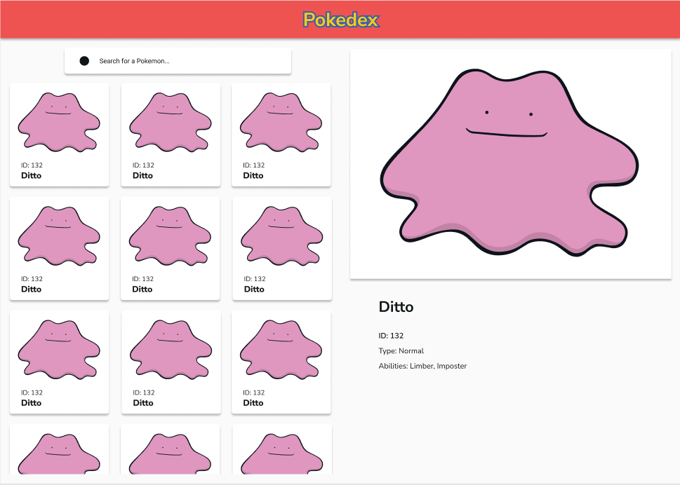
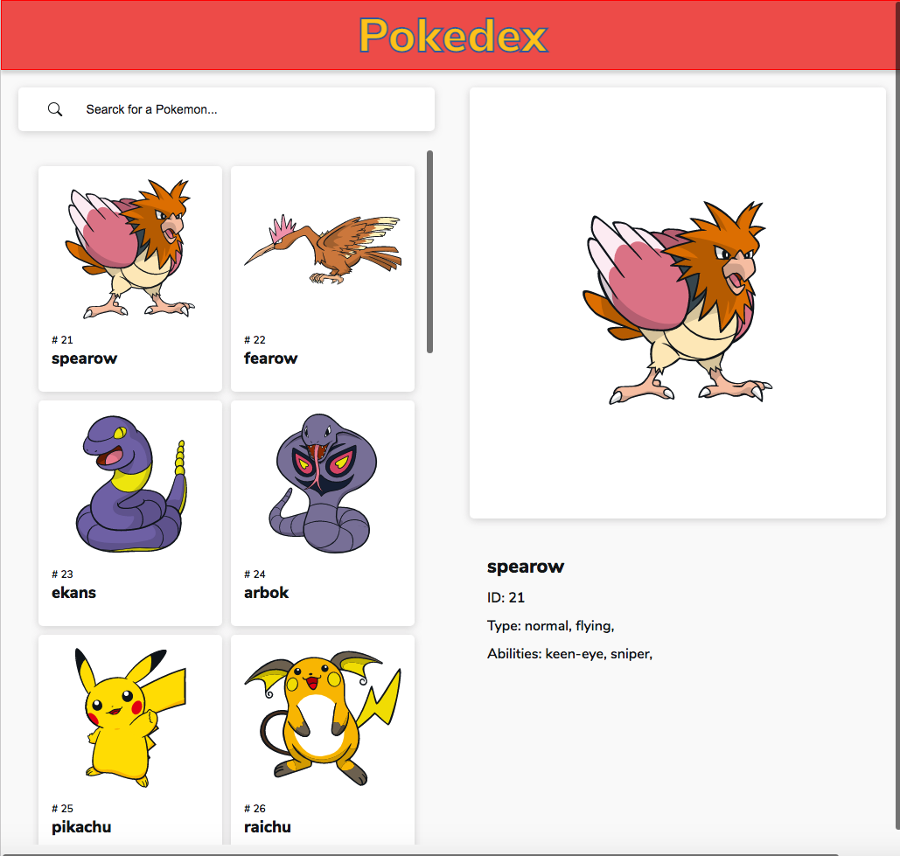

# Pokedex

## Welcome! 👋

PRUEBA TÉCNICA SOFTWARE ENGINEER FRONT-END (REACT)

You can see it here: [Pokedex](https://pokedex-ebon-chi.vercel.app/)

## The challenge

The challenge is to integrate with the [The RESTful Pokémon API](https://pokeapi.co/) to pull Pokemon data and display it like in the designs.

Users should be able to:

- [x] List all Pokémon
- [x] View a Pokémon detailed info (Image, id, name, type, abilities)
- [ ] Search for a specific Pokémon (this feature is not established on the wire frame but find the best location to place it).
- [x] pagination or Infinite Scroll preferred

EXTRA POINTS

- [ ] Redux, redux-saga
- [x] Git Repository
- [ ] React Hooks
- [x] Microfront architecture (https://single-spa.js.org/)

## Design

## Screenshot

