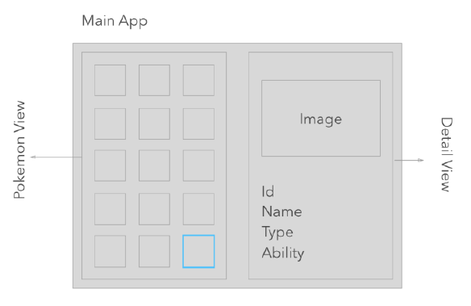

# Pokedex

## Welcome! 👋

PRUEBA TÉCNICA SOFTWARE ENGINEER FRONT-END (REACT)

## The challenge

The challenge is to integrate with the [The RESTful Pokémon API](https://pokeapi.co/) to pull Pokemon data and display it like in the designs.

Users should be able to:

- [] List all Pokémon
- [] View a Pokémon detailed info (Image, id, name, type, abilities)
- [] Search for a specific Pokémon (this feature is not established on the wire frame but find the best location to place it).
- [] pagination or Infinite Scroll preferred

EXTRA POINTS

- [] Redux, redux-saga
- [] Git Repository
- [] React Hooks
- [] Microfront architecture (https://single-spa.js.org/)
